# Database Schema - Entity Relationship Diagram

**Last Updated:** 2025-11-15-22_44
**Purpose:** Visual representation of all database entities and their relationships

---

## Entity Relationship Diagram

**Note:** Enum reference tables (e.g., `ENUM_vendor_status`) are shown for reference only - they are not actual database tables, but represent CHECK constraint values.

```mermaid
erDiagram
    VENDORS ||--o{ TASKS : "has"
    VENDORS ||--o{ REMINDERS : "vendor_reminders"
    VENDORS ||--o{ BUDGET_ITEMS : "has"
    VENDORS ||--o{ COMMUNICATIONS : "has"
    TASKS ||--o{ REMINDERS : "task_reminders"
    AI_SEARCHES ||..o{ VENDORS : "tracks (JSON)"

    VENDORS {
        text id PK
        text name
        text category
        text email
        text phone
        text website
        text city
        text state
        integer starting_price
        text status
        text notes
        text ai_discovery_source
        timestamp last_communication_at
        text last_communication_type
        timestamp created_at
        timestamp updated_at
    }

    TASKS {
        text id PK
        text title
        text description
        text category
        text vendor_id FK
        timestamp due_date
        text timeline_phase
        text priority
        text status
        integer estimated_cost
        integer actual_cost
        text notes
        timestamp created_at
        timestamp updated_at
    }

    REMINDERS {
        text id PK
        text task_id FK
        text vendor_id FK
        text title
        text message
        text reminder_type
        timestamp remind_at
        text recurrence
        text notification_channels
        text status
        timestamp created_at
        timestamp updated_at
    }

    BUDGET_ITEMS {
        text id PK
        text category
        text vendor_id FK
        integer estimated_amount
        integer actual_amount
        integer paid_amount
        text payment_status
        integer deposit_amount
        timestamp deposit_due_date
        timestamp final_payment_due_date
        timestamp created_at
        timestamp updated_at
    }

    AI_SEARCHES {
        text id PK
        text query_text
        text query_type
        text search_parameters
        text image_url
        integer results_count
        text vendors_created
        text ai_model
        integer tokens_used
        integer cost
        timestamp created_at
    }

    COMMUNICATIONS {
        text id PK
        text vendor_id FK
        text direction
        text channel
        text subject
        text message_body
        integer ai_generated
        text communication_type
        timestamp communicated_at
        timestamp created_at
        timestamp updated_at
    }

    ENUM_vendor_status {
        text considering
        text booked
        text rejected
    }

    ENUM_vendor_category {
        text photographer
        text venue
        text caterer
        text florist
        text dj
        text videographer
        text planner
        text baker
        text designer
        text rentals
    }

    ENUM_task_status {
        text todo
        text in_progress
        text waiting
        text completed
        text cancelled
    }

    ENUM_task_priority {
        text low
        text medium
        text high
        text urgent
    }

    ENUM_communication_direction {
        text sent
        text received
    }

    ENUM_communication_channel {
        text email
        text phone
        text text
        text in_person
        text other
    }
```



---

## Entity Descriptions

### vendors
**Primary entity for vendor tracking**

Core vendor information including contact details, pricing, and AI discovery metadata. Serves as the central hub connecting to tasks, reminders, budget items, and communications.

**Key Fields:**
- `id`: UUID v4 stored as TEXT
- `name`: Vendor business name
- `category`: Type of vendor - ENUM ('photographer', 'venue', 'caterer', 'florist', 'dj', 'videographer', 'planner', 'baker', 'designer', 'rentals')
- `status`: Decision pipeline status - ENUM ('considering', 'booked', 'rejected')
- `email`, `phone`, `website`: Contact information
- `city`, `state`: Location for filtering local vendors
- `starting_price`: Base/starting price in cents (INTEGER) - e.g., $299.99 = 29999
- `notes`: Free-form text for services, style notes, impressions, anything
- `ai_discovery_source`: How AI found this vendor (for audit trail)
- `last_communication_at`: Timestamp of most recent communication (auto-updated from communications table)
- `last_communication_type`: Type of last communication (initial_inquiry, follow_up, etc.)

**Relationships:**
- One vendor can have many tasks (1:N)
- One vendor can have many reminders (1:N)
- One vendor can have many budget items (1:N)
- One vendor can have many communications (1:N)

---

### tasks
**Task management with timeline phases**

Wedding planning tasks with priority levels and timeline categorization. Can optionally link to a vendor for vendor-specific tasks.

**Key Fields:**
- `id`: UUID v4 stored as TEXT
- `timeline_phase`: When task should be done (12+ months, 6-9 months, etc.)
- `priority`: Urgency level (low, medium, high, urgent)
- `status`: Current state (todo, in_progress, completed, etc.)
- `vendor_id`: Optional link to vendor (TEXT FK)
- `estimated_cost`: Estimated cost in cents (INTEGER) - e.g., $150.00 = 15000
- `actual_cost`: Actual cost in cents (INTEGER)

**Relationships:**
- Belongs to zero or one vendor
- Can have many reminders

---

### reminders
**Notification system for tasks and vendor follow-ups**

Flexible reminder system that can attach to tasks, vendors, or both. Supports multiple notification channels and recurrence.

**Key Fields:**
- `id`: UUID v4 stored as TEXT
- `task_id`: Optional link to task (TEXT FK, nullable)
- `vendor_id`: Optional link to vendor (TEXT FK, nullable)
- `reminder_type`: Category (follow_up, payment_due, meeting, deadline)
- `remind_at`: When to send reminder (ISO 8601 datetime)
- `recurrence`: Optional recurring pattern (daily, weekly, monthly)
- `notification_channels`: JSON array (["browser", "email"])
- `status`: Current state (pending, sent, dismissed, snoozed)

**Constraints:**
- `CHECK (task_id IS NOT NULL OR vendor_id IS NOT NULL)` - At least one FK required

**Relationships:**
- Belongs to zero or one task
- Belongs to zero or one vendor
- Must have at least one of: task_id OR vendor_id

---

### budget_items
**Budget tracking per category/vendor**

Track estimated vs actual costs, payment status, and deposit tracking. Links to vendors for vendor-specific expenses.

**Key Fields:**
- `id`: UUID v4 stored as TEXT
- `vendor_id`: Optional link to vendor (TEXT FK, nullable)
- `payment_status`: unpaid, deposit_paid, partially_paid, paid
- `estimated_amount`: Budgeted amount in cents (INTEGER) - e.g., $5000.00 = 500000
- `actual_amount`: Final negotiated amount in cents (INTEGER)
- `paid_amount`: Amount paid so far in cents (INTEGER)
- `deposit_amount`: Deposit required in cents (INTEGER)
- `deposit_due_date`: When deposit is due (TIMESTAMP)
- `final_payment_due_date`: When final payment is due (TIMESTAMP)

**Relationships:**
- Belongs to zero or one vendor

---

### ai_searches
**Audit trail and cost tracking for AI usage**

Track all AI searches, parameters used, results generated, and costs incurred. Useful for debugging and budget monitoring.

**Key Fields:**
- `id`: UUID v4 stored as TEXT
- `query_type`: text, image, or hybrid search
- `search_parameters`: JSON of structured search params
- `vendors_created`: JSON array of vendor UUIDs created from this search (TEXT)
- `ai_model`: Which model was used (claude-sonnet-4, etc.)
- `tokens_used`: Token count for cost tracking
- `cost`: Actual cost in cents (INTEGER) - e.g., $0.05 = 5

**Relationships:**
- Links to vendors created from search via JSON array (loose reference, not enforced FK)
- No CASCADE behavior - this is audit-only data

---

### communications
**Communication history and AI message generation tracking**

Track all vendor communications (emails, calls, texts, meetings) to provide context for AI-generated messages and maintain a complete interaction history.

**Key Fields:**
- `id`: UUID v4 stored as TEXT
- `vendor_id`: Link to vendor (TEXT FK, required)
- `direction`: Whether communication was sent or received (sent, received)
- `channel`: Communication method (email, phone, text, in_person, other)
- `message_body`: Full content of the communication
- `ai_generated`: Boolean flag (INTEGER: 0=manual, 1=AI-generated)
- `communication_type`: Category of communication (initial_inquiry, follow_up, quote_request, etc.)
- `communicated_at`: When the communication occurred (separate from created_at for retroactive logging)

**Relationships:**
- Belongs to one vendor (required, NOT NULL)

**Use Cases:**
- Provide context to AI for message generation
- Track vendor interaction history
- Monitor AI-generated vs manual messages
- Enable follow-up reminders based on last contact

---

## Enums and Constraints

### vendor.category
```
photographer | venue | caterer | florist | dj | videographer |
planner | baker | designer | rentals
```

### vendor.status
```
considering | booked | rejected
```

### task.timeline_phase
```
12+ months | 9-12 months | 6-9 months | 3-6 months |
1-3 months | 1 month | 1 week | day of
```

### task.priority
```
low | medium | high | urgent
```

### task.status
```
todo | in_progress | waiting | completed | cancelled
```

### reminder.reminder_type
```
follow_up | payment_due | meeting | deadline | custom
```

### reminder.status
```
pending | sent | dismissed | snoozed
```

### budget_items.payment_status
```
unpaid | deposit_paid | partially_paid | paid
```

### ai_searches.query_type
```
text | image | hybrid
```

### communications.direction
```
sent | received
```

### communications.channel
```
email | phone | text | in_person | other
```

### communications.communication_type
```
initial_inquiry | follow_up | quote_request | quote_received |
meeting_scheduling | decision_notification | question | answer |
contract_discussion | payment_discussion | other
```

---

## Relationship Summary

| From | To | Type | Cascade Behavior | Rationale |
|------|-----|------|------------------|-----------|
| vendors | tasks | 1:N | **ON DELETE SET NULL** | Tasks can exist without vendor (generic wedding tasks) |
| vendors | reminders | 1:N | **ON DELETE CASCADE** | Vendor reminders are meaningless without the vendor |
| vendors | budget_items | 1:N | **ON DELETE CASCADE** | Budget items are vendor-specific, delete with vendor |
| vendors | communications | 1:N | **ON DELETE CASCADE** | Communication history belongs to vendor |
| tasks | reminders | 1:N | **ON DELETE CASCADE** | Task reminders are meaningless without the task |
| ai_searches | vendors | 1:N | **No FK** (JSON array) | Loose audit trail reference, not enforced |

---

## JSON Field Schemas

### reminders.notification_channels
```json
["browser", "email"]
```

### ai_searches.search_parameters
```json
{
  "vendor_type": "photographer",
  "location": "Austin, TX",
  "max_budget": 3000,
  "style_keywords": ["vintage", "film"],
  "requirements": ["engagement shoot included"]
}
```

### ai_searches.vendors_created
```json
["vendor-id-1", "vendor-id-2", "vendor-id-3"]
```

---

## Implementation Notes

### SQLite Data Types
- `string` → `TEXT`
- `int` → `INTEGER`
- `boolean` → `INTEGER` (0 or 1)
- `datetime` → `TEXT` (ISO 8601 format)
- `json` → `TEXT` (stored as JSON string)
- `money` → `INTEGER` (stored as cents) - e.g., $299.99 = 29999
- `uuid` → `TEXT` (UUID v4 format)

### ID Generation
All IDs use UUID v4 format stored as TEXT:
```go
import "github.com/google/uuid"

id := uuid.New().String() // "550e8400-e29b-41d4-a716-446655440000"
```

### Money/Currency Storage
All monetary values are stored as **INTEGER cents** to avoid floating-point precision errors:
```go
// Storing $299.99
priceInCents := 29999  // Store as INTEGER

// Displaying to user
priceInDollars := float64(priceInCents) / 100.0  // 299.99
fmt.Printf("$%.2f", priceInDollars)  // "$299.99"

// Parsing user input "$1,234.56"
inputStr := "$1,234.56"
cleaned := strings.ReplaceAll(strings.TrimPrefix(inputStr, "$"), ",", "")
dollars, _ := strconv.ParseFloat(cleaned, 64)
cents := int(dollars * 100)  // 123456
```

### Timestamps
All timestamps use ISO 8601 format:
```
2025-11-15T15:29:00Z
```

**Note:** The `updated_at` field is manually updated in Go code during UPDATE operations, not via database triggers.

### NULL vs Empty
- Use `NULL` for optional fields that are truly absent
- Use empty string `""` for optional text fields when explicitly set to empty
- Use `0` for monetary fields when value is zero (not NULL)

### ENUM Implementation
ENUMs are implemented using CHECK constraints in SQLite:

```sql
CREATE TABLE vendors (
    id TEXT PRIMARY KEY,  -- UUID v4
    name TEXT NOT NULL,
    category TEXT NOT NULL CHECK(category IN (
        'photographer', 'venue', 'caterer', 'florist', 'dj',
        'videographer', 'planner', 'baker', 'designer', 'rentals'
    )),
    email TEXT,
    phone TEXT,
    website TEXT,
    city TEXT,
    state TEXT,
    starting_price INTEGER,  -- Stored as cents
    status TEXT NOT NULL DEFAULT 'considering' CHECK(status IN (
        'considering', 'booked', 'rejected'
    )),
    notes TEXT,
    ai_discovery_source TEXT,
    last_communication_at TIMESTAMP,
    last_communication_type TEXT,
    created_at TIMESTAMP DEFAULT CURRENT_TIMESTAMP,
    updated_at TIMESTAMP DEFAULT CURRENT_TIMESTAMP
);

CREATE INDEX idx_vendors_status ON vendors(status);
CREATE INDEX idx_vendors_category ON vendors(category);
CREATE INDEX idx_vendors_last_communication_at ON vendors(last_communication_at);
```

### Foreign Key Cascade Examples
```sql
-- Tasks: Keep task if vendor deleted, just set vendor_id to NULL
CREATE TABLE tasks (
    id TEXT PRIMARY KEY,
    vendor_id TEXT REFERENCES vendors(id) ON DELETE SET NULL,
    ...
);

-- Communications: Delete communication history if vendor deleted
CREATE TABLE communications (
    id TEXT PRIMARY KEY,
    vendor_id TEXT NOT NULL REFERENCES vendors(id) ON DELETE CASCADE,
    ...
);

-- Reminders: Require at least one FK (task OR vendor)
CREATE TABLE reminders (
    id TEXT PRIMARY KEY,
    task_id TEXT REFERENCES tasks(id) ON DELETE CASCADE,
    vendor_id TEXT REFERENCES vendors(id) ON DELETE CASCADE,
    ...
    CHECK (task_id IS NOT NULL OR vendor_id IS NOT NULL)
);
```

---

## Recommended Indexes

### Foreign Key Indexes (Required for JOIN Performance)
```sql
-- tasks table
CREATE INDEX idx_tasks_vendor_id ON tasks(vendor_id);

-- reminders table
CREATE INDEX idx_reminders_task_id ON reminders(task_id);
CREATE INDEX idx_reminders_vendor_id ON reminders(vendor_id);

-- budget_items table
CREATE INDEX idx_budget_items_vendor_id ON budget_items(vendor_id);

-- communications table
CREATE INDEX idx_communications_vendor_id ON communications(vendor_id);
```

### Query Optimization Indexes
```sql
-- Vendors: filter by status and category (common queries)
CREATE INDEX idx_vendors_status ON vendors(status);
CREATE INDEX idx_vendors_category ON vendors(category);
CREATE INDEX idx_vendors_last_communication_at ON vendors(last_communication_at);

-- Tasks: filter by status, due date, timeline
CREATE INDEX idx_tasks_status ON tasks(status);
CREATE INDEX idx_tasks_due_date ON tasks(due_date);
CREATE INDEX idx_tasks_timeline_phase ON tasks(timeline_phase);

-- Reminders: find pending reminders by date
CREATE INDEX idx_reminders_status ON reminders(status);
CREATE INDEX idx_reminders_remind_at ON reminders(remind_at);
CREATE INDEX idx_reminders_status_remind_at ON reminders(status, remind_at);  -- Composite

-- Communications: chronological history
CREATE INDEX idx_communications_communicated_at ON communications(communicated_at);
CREATE INDEX idx_communications_vendor_communicated ON communications(vendor_id, communicated_at);  -- Composite
```

**Index Rationale:**
- **FK indexes**: Speed up JOINs (e.g., "get all tasks for vendor X")
- **Status indexes**: Speed up filters (e.g., "show all booked vendors")
- **Date indexes**: Speed up chronological queries (e.g., "reminders due today")
- **Composite indexes**: Speed up multi-column queries (e.g., "pending reminders due before tomorrow")

---

## Full SQL Schema

See `backend/migrations/` for complete CREATE TABLE statements with:
- Column constraints (NOT NULL, DEFAULT, CHECK)
- Foreign key constraints
- Indexes for common queries
- Triggers for updated_at timestamps

---

**For detailed implementation patterns, see `PATTERNS.md`**
