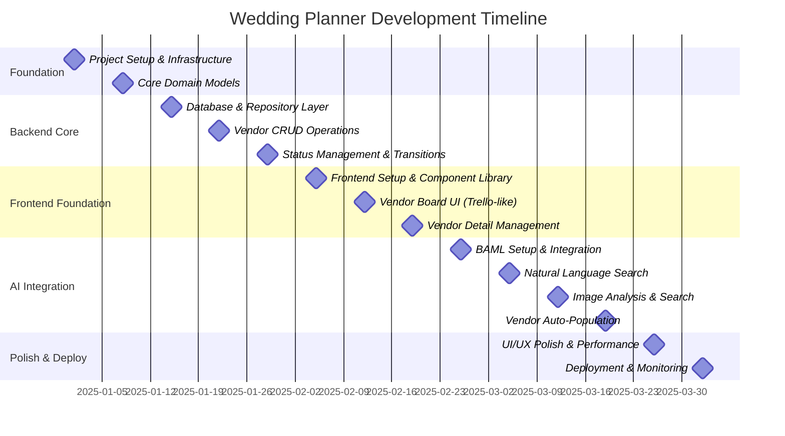
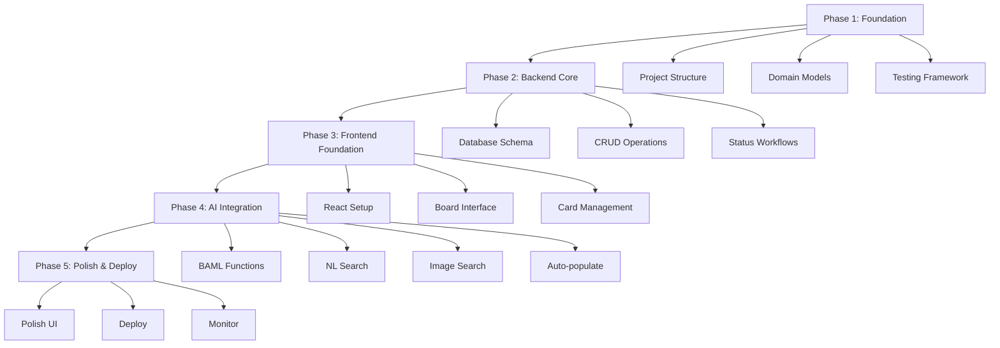

# Wedding Planner - Development Timeline

## Project Phases and Functionality Development



## Capability Timeline



---

## Ticket Prompts for /create_ticket

### Phase 1: Foundation

#### Ticket 1: Project Setup & Infrastructure
**Prompt:**
```
Create the initial project structure for the Wedding Planner Go backend with proper TDD/DDD organization. Set up the following:

1. Go module initialization with appropriate dependencies
2. Directory structure following DDD layers (domain, application, infrastructure, interfaces)
3. Testing framework setup (testify, mockgen)
4. CI/CD pipeline with GitHub Actions for:
   - Running tests on every PR
   - Linting with golangci-lint
   - Code coverage reporting (minimum 80%)
5. Development tooling:
   - Air for live reload
   - golangci-lint configuration
   - Makefile with common commands (test, build, lint, run)
6. Docker setup for local development
7. README with setup instructions

Success criteria:
- `make test` runs successfully
- CI pipeline passes
- Project follows standard Go layout
- All tooling documented
```

**Justification:** This establishes the foundation for TDD/DDD development. Having CI/CD from day one ensures quality gates are in place. The directory structure must align with DDD principles before any code is written, preventing architectural drift.

---

#### Ticket 2: Core Domain Models & Bounded Contexts
**Prompt:**
```
Design and implement the core domain models for the Wedding Planner using DDD principles and TDD approach.

Requirements:
1. Define bounded contexts:
   - Vendor Management Context
   - Search Context
   - Communication Context

2. Implement domain entities with tests first (TDD):
   - Vendor aggregate (root entity)
   - VendorID value object
   - ContactInfo value object
   - Money value object
   - VendorCategory value object (enum: Caterer, Venue, Florist, Photographer, DJ, etc.)
   - VendorStatus value object (enum: NeedsResearch, NeedToContact, InDiscussion, MovingForward, NotMovingForward, Booked)

3. Domain behaviors:
   - Vendor.ChangeStatus(newStatus) with business rules
   - Vendor.UpdateContact(contactInfo)
   - Vendor.UpdatePricing(money)
   - Vendor.RecordContact(date, notes)

4. Domain events:
   - VendorCreated
   - VendorStatusChanged
   - VendorContacted

5. Repository interfaces (contracts only, no implementation):
   - VendorRepository interface
   - Define query methods (FindByStatus, FindByCategory, etc.)

Success criteria:
- All domain models have 100% test coverage
- Value objects are immutable
- Entities have identity equality
- Business rules enforced in domain layer
- No infrastructure dependencies in domain layer
- Domain events properly defined
```

**Justification:** The domain layer is the heart of DDD. Building it first with comprehensive tests ensures the business logic is correct before adding any infrastructure. This ticket focuses purely on the "what" (domain) without the "how" (infrastructure), maintaining proper separation of concerns.

---

### Phase 2: Backend Core

#### Ticket 3: Database Schema & Repository Implementation
**Prompt:**
```
Implement the database layer for vendor persistence using TDD and repository pattern.

Requirements:
1. Design PostgreSQL schema:
   - vendors table with all necessary columns
   - vendor_status_history table for audit trail
   - vendor_contacts_log table for communication tracking
   - Appropriate indexes for common queries

2. Set up database migrations:
   - Use golang-migrate or similar
   - Version controlled migrations
   - Up/down migration support

3. Implement VendorRepository:
   - Write integration tests first using testcontainers-go
   - Implement repository methods to pass tests
   - Methods: Save, FindByID, FindByStatus, FindByCategory, FindAll, Delete

4. Connection management:
   - Database connection pooling
   - Context-aware queries (cancellation support)
   - Transaction support

5. Error handling:
   - Wrap database errors appropriately
   - Return domain-specific errors

Success criteria:
- All repository tests pass using real PostgreSQL (via testcontainers)
- Migrations run successfully
- Repository respects domain contracts
- No SQL injection vulnerabilities
- Proper connection pooling configured
- Integration tests achieve 100% coverage of repository methods
```

**Justification:** Repository implementation is tested against real databases using testcontainers to ensure correctness. This prevents surprises in production and validates that our domain models map correctly to the database. Integration tests here are critical for confidence.

---

#### Ticket 4: Vendor CRUD Application Services & REST API
**Prompt:**
```
Build the application service layer and REST API for vendor CRUD operations using TDD.

Requirements:
1. Application Services (write tests first):
   - VendorService with methods:
     - CreateVendor(ctx, CreateVendorDTO) (*Vendor, error)
     - GetVendor(ctx, VendorID) (*Vendor, error)
     - UpdateVendor(ctx, UpdateVendorDTO) (*Vendor, error)
     - DeleteVendor(ctx, VendorID) error
     - ListVendors(ctx, filters) ([]*Vendor, error)
   - Mock repository for unit tests
   - Test business rules and validations

2. REST API Handlers:
   - POST /api/v1/vendors - Create vendor
   - GET /api/v1/vendors/:id - Get vendor
   - PUT /api/v1/vendors/:id - Update vendor
   - DELETE /api/v1/vendors/:id - Delete vendor
   - GET /api/v1/vendors - List vendors with filtering

3. DTOs and validation:
   - Request/Response DTOs
   - Input validation using validator library
   - Proper error responses (RFC 7807)

4. HTTP layer setup:
   - Chi router or Gin framework
   - Middleware (logging, CORS, error handling)
   - OpenAPI/Swagger documentation

5. Integration tests:
   - Test full HTTP request/response cycle
   - Use httptest for handler testing

Success criteria:
- All application service tests pass with mocked repositories
- All HTTP handler tests pass
- API follows REST conventions
- Proper HTTP status codes
- OpenAPI spec generated and accurate
- Integration tests cover happy path and error cases
```

**Justification:** Application services orchestrate domain operations and provide transaction boundaries. Building the API on top of well-tested services ensures we can swap transport layers if needed. This ticket delivers the first usable feature: basic vendor management.

---

#### Ticket 5: Vendor Status Management & Workflow
**Prompt:**
```
Implement vendor status transitions and workflow management with comprehensive testing.

Requirements:
1. Status transition rules (TDD approach):
   - Define valid state transitions in domain layer
   - Implement VendorStatusWorkflow domain service
   - Business rules:
     - NeedsResearch → NeedToContact → InDiscussion → MovingForward → Booked
     - Any status → NotMovingForward (rejection path)
     - Prevent invalid transitions
   - Write tests for all valid and invalid transitions

2. Status history tracking:
   - Record all status changes with timestamp and reason
   - Implement StatusHistory value object
   - Repository method to fetch status history

3. API endpoints:
   - PUT /api/v1/vendors/:id/status - Change vendor status
   - GET /api/v1/vendors/:id/history - Get status history
   - GET /api/v1/vendors?status=X - Filter by status (enhance existing endpoint)

4. Domain events:
   - Emit VendorStatusChanged events
   - Event store setup (in-memory for now)

5. Board view support:
   - Endpoint to get vendors grouped by status: GET /api/v1/board
   - Returns data structure suitable for Kanban board

Success criteria:
- All status transition tests pass
- Invalid transitions are rejected with clear errors
- Status history accurately tracked
- Board endpoint returns properly grouped vendors
- Domain events emitted correctly
- 100% test coverage on workflow logic
```

**Justification:** Status workflow is core to the Trello-like interface. Implementing it in the domain layer with strict rules prevents data inconsistencies. This ticket completes the backend foundation needed for the board UI.

---

### Phase 3: Frontend Foundation

#### Ticket 6: Frontend Project Setup & Component Library
**Prompt:**
```
Set up the React frontend application with TypeScript and establish the component library.

Requirements:
1. Initialize React project:
   - Create React App with TypeScript or Vite
   - ESLint and Prettier configuration
   - Testing setup (Jest, React Testing Library)
   - CI/CD integration for frontend tests

2. Project structure:
   - Components directory (atoms, molecules, organisms pattern)
   - Pages directory
   - Services/API directory
   - Types directory
   - Utils directory

3. Core dependencies:
   - React Router for navigation
   - Axios or Fetch for API calls
   - React Query for server state management
   - Tailwind CSS or Material-UI for styling
   - React DnD or similar for drag-and-drop

4. Base components (with tests):
   - Button
   - Input
   - Card
   - Modal
   - Dropdown
   - Loading spinner
   - Error boundary

5. API client setup:
   - Type-safe API client
   - Base URL configuration
   - Error handling
   - Request/response interceptors

6. Mock API for development:
   - MSW (Mock Service Worker) setup
   - Mock data for vendors
   - Mock endpoints matching backend API

Success criteria:
- Frontend builds successfully
- All base components have tests
- Storybook or similar for component development
- API client properly typed
- MSW mocks working for development
- npm test passes
```

**Justification:** Frontend foundation with proper TypeScript and testing infrastructure enables TDD on the frontend. Component library approach ensures UI consistency. MSW allows frontend development without backend dependency.

---

#### Ticket 7: Vendor Board UI (Trello-like Interface)
**Prompt:**
```
Build the Kanban-style vendor board interface with drag-and-drop functionality.

Requirements:
1. Board layout:
   - Columns for each VendorStatus (NeedsResearch, NeedToContact, etc.)
   - Responsive grid layout
   - Horizontal scrolling for many columns

2. Vendor card component (test-driven):
   - Display vendor name, category icon, price range
   - Color coding by category
   - Click to view details
   - Drag handle for reordering

3. Drag-and-drop functionality:
   - Drag cards between columns (status change)
   - Reorder cards within column
   - Optimistic UI updates
   - API call to update status on drop
   - Rollback on error

4. Board features:
   - Filter by category
   - Search vendors by name
   - Add new vendor button (opens modal)
   - Column headers with vendor count

5. State management:
   - React Query for fetching board data
   - Optimistic updates for drag operations
   - Real-time refetch after mutations

6. Testing:
   - Component tests for Board and Card
   - Integration tests for drag-and-drop
   - Mock API interactions

Success criteria:
- Board displays vendors in correct columns
- Drag-and-drop works smoothly
- Status changes persist to backend
- Optimistic updates provide good UX
- Works on mobile and desktop
- All components tested
```

**Justification:** The board interface is the primary UI of the application. Building it after the backend ensures we have real data to work with. Drag-and-drop with optimistic updates provides excellent UX while maintaining data integrity.

---

#### Ticket 8: Vendor Detail Management & Forms
**Prompt:**
```
Implement vendor detail view and CRUD forms with validation.

Requirements:
1. Vendor detail modal/page:
   - View all vendor information
   - Edit in place
   - Delete vendor (with confirmation)
   - Status change dropdown
   - Contact history timeline
   - Notes section

2. Forms (TDD approach):
   - Create vendor form
   - Edit vendor form
   - Field validation (required fields, format validation)
   - Error messages
   - Form state management (React Hook Form or Formik)

3. Fields to support:
   - Name (required)
   - Category (dropdown, required)
   - Contact name
   - Phone (with formatting)
   - Email (with validation)
   - Website (URL validation)
   - Price/Budget (formatted currency input)
   - Notes (rich text editor)
   - Custom fields

4. Contact logging:
   - Add contact log entry
   - Display contact history
   - Filter/sort contact logs

5. UX features:
   - Auto-save draft
   - Unsaved changes warning
   - Loading states
   - Success/error toasts

Success criteria:
- Forms have proper validation
- All fields save correctly
- Contact logs display properly
- Delete confirmation prevents accidents
- Form tests cover validation logic
- Accessible forms (keyboard navigation, screen readers)
```

**Justification:** Detail management completes the manual vendor CRUD workflow. This gives users full control before we add AI features. Rich forms with validation ensure data quality.

---

### Phase 4: AI Integration

#### Ticket 9: BAML Setup & Integration
**Prompt:**
```
Integrate BAML into the backend for structured LLM interactions.

Requirements:
1. BAML installation and setup:
   - Install BAML CLI and Go generator
   - Configure BAML tooling in baml/ directory (created in Ticket 1)
   - Configure BAML client for Go integration
   - Add BAML to build pipeline

2. Define core BAML types:
   - VendorCategory enum
   - VendorStatus enum
   - SearchCriteria class
   - VendorInformation class
   - PriceRange class
   - Location class

3. First BAML function - Query Parser:
   - Function: ParseSearchQuery(query: string) -> SearchCriteria
   - Extracts: category, location, keywords, price range, requirements
   - Write tests using BAML's testing framework
   - Test with various natural language inputs

4. LLM configuration:
   - Support multiple providers (OpenAI, Anthropic)
   - Environment-based configuration
   - Fallback providers
   - Rate limiting

5. Integration with Go backend:
   - Generate Go client from BAML
   - Create SearchService application service
   - Use BAML function in SearchService
   - Write unit tests with mocked BAML responses

6. Error handling:
   - Handle LLM failures gracefully
   - Validation of BAML outputs
   - Retry logic with exponential backoff

Success criteria:
- BAML generates Go client successfully
- ParseSearchQuery function tested with 10+ examples
- SearchService integrates BAML correctly
- All tests pass including error cases
- Documentation for adding new BAML functions
```

**Justification:** BAML integration is foundational for all AI features. Setting it up properly with testing ensures reliable LLM interactions. Starting with query parsing validates the integration before more complex features.

---

#### Ticket 10: Natural Language Vendor Search & Discovery
**Prompt:**
```
Implement AI-powered natural language search for vendor discovery.

Requirements:
1. BAML functions (test-driven):
   - ExtractVendorInfo(webContent: string) -> VendorInformation
   - GenerateSummary(vendorInfo: VendorInformation) -> string
   - RankVendors(criteria: SearchCriteria, vendors: VendorInformation[]) -> RankedVendor[]

2. Search orchestration:
   - SearchService methods:
     - SearchVendors(ctx, naturalLanguageQuery) -> SearchResults
   - Workflow:
     1. Parse query with BAML (ParseSearchQuery)
     2. Search external sources (Google Places API, Yelp API, web scraping)
     3. Extract vendor info with BAML
     4. Rank results with BAML
     5. Generate summaries
     6. Return structured results

3. External integrations:
   - Google Places API for business search
   - Yelp Fusion API for reviews and ratings
   - Web scraping for additional details (respectful, cached)
   - Rate limiting and caching

4. API endpoints:
   - POST /api/v1/search - Natural language search
   - POST /api/v1/search/:id/save - Save search result as vendor card

5. Testing:
   - Unit tests for BAML functions (mocked LLM)
   - Integration tests with real APIs (using test keys)
   - E2E test with full search workflow
   - Test various query types

Success criteria:
- Natural language queries return relevant vendors
- BAML extracts accurate vendor information
- Results ranked appropriately
- External API calls cached to reduce costs
- Search completes in <10 seconds for most queries
- All components tested
```

**Justification:** Natural language search is a core differentiator. This ticket delivers significant user value by automating vendor research. Integration with real search APIs makes results practical and useful.

---

#### Ticket 11: Image-Based Vendor Search & Visual Similarity
**Prompt:**
```
Implement image upload and visual similarity search for vendor discovery.

Requirements:
1. Image handling:
   - Backend endpoint: POST /api/v1/search/image
   - Accept image uploads (multipart/form-data)
   - Image validation (format, size limits)
   - Store images temporarily (S3 or local storage)

2. BAML vision functions:
   - AnalyzeImage(image: Image, description: string) -> ImageAnalysis
   - ExtractVisualFeatures(image: Image) -> VisualFeatures
   - FindSimilarVendors(features: VisualFeatures, query: string, location: string) -> VendorMatch[]

3. Image search workflow:
   - User uploads image + text query
   - BAML analyzes image (color, style, type, features)
   - Generate search queries based on visual analysis
   - Search vendors matching visual criteria
   - Return ranked results

4. Example use cases (test with these):
   - Upload chair image → find furniture rental vendors with similar items
   - Upload bouquet image → find florists with similar style
   - Upload venue image → find venues with similar aesthetic
   - Upload table setting → find event rental companies

5. Frontend integration:
   - Image upload component
   - Preview uploaded image
   - Combine with text query input
   - Display search results with image thumbnails

6. Testing:
   - Unit tests for image processing
   - BAML vision function tests with sample images
   - Integration tests with full workflow
   - Test with various image types and qualities

Success criteria:
- Image upload works reliably
- BAML accurately describes uploaded images
- Search results match visual criteria
- Works with common image formats (JPG, PNG, WebP)
- Image search UI is intuitive
- Full workflow tested end-to-end
```

**Justification:** Image search adds unique value for visual elements like decor, venues, and styling. BAML's vision capabilities make this feasible without building custom computer vision. This ticket showcases advanced AI integration.

---

#### Ticket 12: Auto-Population of Vendor Cards from Search
**Prompt:**
```
Implement automatic vendor card creation from search results with user confirmation.

Requirements:
1. Search result actions:
   - Each search result shows "Add to Board" button
   - Preview card before adding
   - Select initial status (default: NeedsResearch)
   - Bulk add multiple results

2. Auto-population logic:
   - Map SearchResult → CreateVendorDTO
   - Pre-fill all available fields
   - Set source metadata (search query, timestamp)
   - Generate initial summary from BAML

3. User review workflow:
   - Display pre-populated card in modal
   - Allow edits before saving
   - Highlight AI-generated fields
   - Confidence scores for extracted data

4. Batch operations:
   - Select multiple search results
   - Confirm batch add
   - Progress indicator for bulk creation
   - Error handling for individual failures

5. BAML enhancement:
   - ConfidenceScore for each extracted field
   - Suggestions for missing fields
   - Alternative interpretations

6. API endpoints:
   - POST /api/v1/vendors/from-search - Create vendor from search result
   - POST /api/v1/vendors/batch - Bulk create vendors

7. Testing:
   - Test auto-population accuracy
   - Test user confirmation flow
   - Test batch operations
   - Test error handling and rollback

Success criteria:
- Search results auto-populate correctly
- User can review before saving
- Batch add works for multiple vendors
- AI-generated content clearly marked
- Undo/rollback if needed
- All workflows tested
```

**Justification:** Auto-population closes the loop on the AI search feature. This delivers the full "search → add to board" workflow that makes the app truly powerful. User confirmation ensures data quality while maintaining speed.

---

### Phase 5: Polish & Deploy

#### Ticket 13: UI/UX Polish & Performance Optimization
**Prompt:**
```
Polish the user interface, improve performance, and enhance user experience.

Requirements:
1. Performance optimizations:
   - Frontend: Code splitting, lazy loading
   - Backend: Query optimization, caching (Redis)
   - Image optimization (compression, CDN)
   - API response time < 200ms for CRUD operations
   - Search operations < 5 seconds

2. UX improvements:
   - Loading skeletons instead of spinners
   - Optimistic updates everywhere possible
   - Error recovery suggestions
   - Empty states with helpful actions
   - Keyboard shortcuts for power users
   - Undo/redo for critical actions

3. Visual polish:
   - Consistent spacing and typography
   - Smooth animations and transitions
   - Dark mode support
   - Mobile responsive design refinement
   - Accessibility improvements (WCAG 2.1 AA)

4. Data visualization:
   - Budget tracker dashboard
   - Vendor category distribution chart
   - Timeline view of vendor interactions
   - Export vendor data to CSV/PDF

5. User feedback:
   - Onboarding tour for new users
   - Contextual help tooltips
   - Success/error toast improvements
   - Progress indicators for long operations

6. Testing:
   - Performance tests (Lighthouse score > 90)
   - Accessibility tests (axe-core)
   - Cross-browser testing
   - Mobile device testing

Success criteria:
- Lighthouse performance score > 90
- WCAG 2.1 AA compliant
- Works on Chrome, Firefox, Safari, Edge
- Mobile responsive on iOS and Android
- All interactions feel fast and smooth
- User testing feedback incorporated
```

**Justification:** Polish transforms a functional app into a delightful one. Performance optimization ensures scalability. Accessibility ensures the app works for everyone. This ticket prepares the app for production use.

---

#### Ticket 14: Deployment, Monitoring & Production Readiness
**Prompt:**
```
Deploy the application to production with proper monitoring and observability.

Requirements:
1. Infrastructure setup:
   - Backend: Deploy to Cloud Run, ECS, or Kubernetes
   - Frontend: Deploy to Vercel, Netlify, or Cloudflare Pages
   - Database: Managed PostgreSQL (RDS, Cloud SQL, or Supabase)
   - Redis: Managed Redis for caching
   - Object storage: S3 or equivalent for images

2. CI/CD pipeline:
   - Automated deployments on merge to main
   - Staging environment for testing
   - Database migrations in deployment pipeline
   - Rollback capability
   - Blue-green or canary deployments

3. Monitoring and observability:
   - Application logs (structured logging)
   - Metrics: Prometheus + Grafana or Datadog
   - Error tracking: Sentry or Rollbar
   - Uptime monitoring: UptimeRobot or Pingdom
   - APM: Trace requests end-to-end

4. Alerts:
   - Error rate threshold alerts
   - Response time degradation
   - Database connection issues
   - LLM API failures
   - Budget alerts for cloud costs

5. Security:
   - HTTPS everywhere
   - Environment variables for secrets
   - API rate limiting
   - CORS configuration
   - Security headers
   - Regular dependency updates

6. Backup and recovery:
   - Automated database backups
   - Backup restoration testing
   - Disaster recovery plan
   - Data retention policies

7. Documentation:
   - Runbook for common issues
   - Architecture diagram
   - API documentation
   - Deployment guide
   - Monitoring dashboard guide

Success criteria:
- Application deployed and accessible
- Zero-downtime deployments working
- Monitoring dashboards show key metrics
- Alerts fire correctly
- Backup restoration tested
- Security scan passes
- Load testing shows app handles expected traffic
```

**Justification:** Production deployment requires reliability, observability, and security. Proper monitoring enables quick response to issues. This ticket ensures the app is production-ready and maintainable long-term.

---

## Development Principles Across All Tickets

### Test-Driven Development (TDD)
Every ticket MUST follow the Red-Green-Refactor cycle:
1. Write failing tests first
2. Write minimal code to pass
3. Refactor while keeping tests green

### Domain-Driven Design (DDD)
- Domain logic stays in the domain layer
- Infrastructure details don't leak into domain
- Ubiquitous language used consistently
- Bounded contexts respected

### Code Review Standards
- All PRs require passing tests
- Code coverage must not decrease
- Linting must pass
- At least one approval required

---

## Timeline Rationale

### Why This Order?

1. **Foundation First (Tickets 1-2)**: Proper structure and domain modeling prevent costly refactoring later. TDD/DDD foundations must be solid.

2. **Backend Before Frontend (Tickets 3-5)**: Well-tested backend with real data structures informs frontend design. Prevents frontend rework.

3. **Manual CRUD Before AI (Tickets 6-8)**: Users need basic vendor management even if AI fails. Establishes core value proposition.

4. **BAML Setup Before AI Features (Ticket 9)**: AI infrastructure must be tested independently before complex features depend on it.

5. **Search Before Image (Tickets 10-11)**: Text search is simpler and validates the BAML integration. Image search builds on proven patterns.

6. **Auto-population Last in AI Phase (Ticket 12)**: Requires both search features working. Represents full AI workflow.

7. **Polish Before Deploy (Ticket 13)**: Production app must feel professional. Performance issues caught before users see them.

8. **Deploy Last (Ticket 14)**: Only deploy when features are complete and polished. Monitoring ensures production stability.

### Incremental Value Delivery

- Ticket 4: First usable feature (manual vendor management via API)
- Ticket 7: First UI (board view)
- Ticket 8: Complete manual workflow
- Ticket 10: First AI feature (NL search)
- Ticket 12: Complete AI workflow
- Ticket 14: Production-ready application

Each ticket delivers working, tested functionality. No "big bang" releases.

### Risk Mitigation

- Early tickets derisk architecture decisions
- BAML validated before heavy AI investment
- External API integration tested incrementally
- Performance issues caught before production
- Security baked in from the start

---

## How to Use This Timeline

1. **Create tickets sequentially**: Use `/create_ticket` with each prompt in order
2. **Complete before moving on**: Finish each ticket's success criteria before the next
3. **Adapt as needed**: Timeline is a guide, not a straitjacket. Adjust based on learnings.
4. **Maintain TDD/DDD**: Never skip tests or violate domain boundaries to "move faster"
5. **Review and iterate**: Retrospect after each phase to improve processes

---

## Success Metrics

By the end of this timeline, we will have:
- ✅ Fully tested backend (>80% coverage)
- ✅ Domain-driven architecture
- ✅ Production-ready deployment
- ✅ AI-powered vendor search
- ✅ Intuitive Trello-like UI
- ✅ Comprehensive monitoring
- ✅ Scalable, maintainable codebase

**Estimated timeline**: 12-14 weeks with 1-2 developers following this plan strictly.
